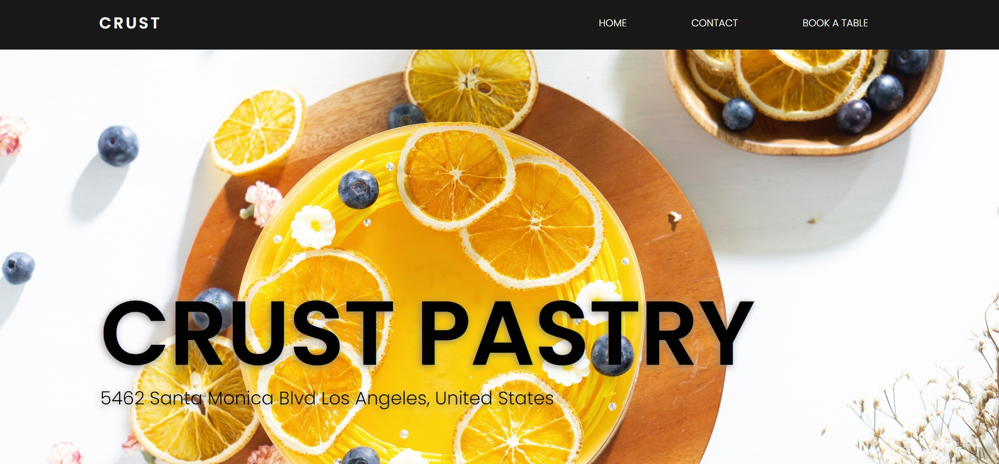

# pastry-site-project

An assignment I focused on creating a responsive site using 

flexbox & grid and used HTML, CSS, JS & a JS library ‘Tilt.js’.

---

[Demo](https://aya-94.github.io/pastry-site-project/)

