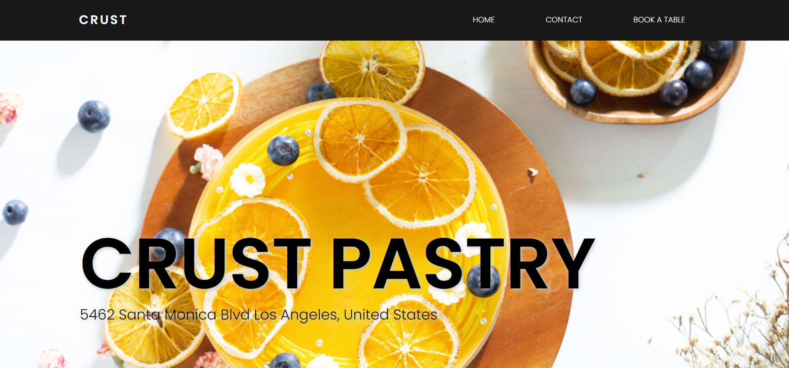

# pastry-site-project

A project of pasrty site using HTML, CSS, JS and a JS library 'JS-tilt'.

In this projects I focused on creating a responsive site using flexbox & grid.

link to watch => https://aya-94.github.io/pastry-site-project/

